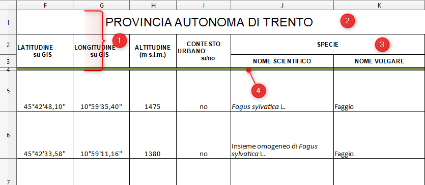
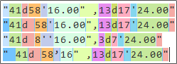

<!-- TOC -->

- [Dove sono gli alberi monumentali d'Italia?](#dove-sono-gli-alberi-monumentali-ditalia)
    - [L'elaborazione di un dataset e una richiesta al ministero](#lelaborazione-di-un-dataset-e-una-richiesta-al-ministero)
- [Obiettivo propedeutico: estrarre un'unica tabella per tutti gli alberi italiani](#obiettivo-propedeutico--estrarre-ununica-tabella-per-tutti-gli-alberi-italiani)
    - [Struttura dei file originali](#struttura-dei-file-originali)
    - [Contenuti dei file originali](#contenuti-dei-file-originali)
    - [Gli strumenti utilizzati](#gli-strumenti-utilizzati)
- [Alcune note sullo script](#alcune-note-sullo-script)
    - [Evviva le espressioni regolari](#evviva-le-espressioni-regolari)
    - [Convertire i file ods in batch](#convertire-i-file-ods-in-batch)
    - [Associare il codice comunale ISTAT a ogni albero](#associare-il-codice-comunale-istat-a-ogni-albero)
        - [Con GDAL/OGR](#con-gdal-ogr)
        - [Mapshaper](#mapshaper)
- [Buone letture](#buone-letture)
- [Note finali](#note-finali)

<!-- /TOC -->
# Dove sono gli alberi monumentali d'Italia?
## L'elaborazione di un dataset e una richiesta al ministero

A [fine 2017](https://www.politicheagricole.it/flex/cm/pages/ServeBLOB.php/L/IT/IDPagina/12052) il **Ministero delle politiche agricole alimentari e forestali** ha dato notizia della creazione e della pubblicazione del [**primo elenco degli Alberi Monumentali d'Italia**](https://www.politicheagricole.it/flex/cm/pages/ServeBLOB.php/L/IT/IDPagina/11260).

> L'elenco, diviso per Regioni, si compone di **2407** alberi che si contraddistinguono per l'**elevato valore biologico** ed **ecologico** (età, dimensioni, morfologia, rarità della specie, habitat per alcune specie animali), per l'**importanza storica**, **culturale** e **religiosa** che rivestono in determinati contesti territoriali.

È un dataset interessante, che contribuirà a fare conoscere un patrimonio di grande valore, probabilmente poco conosciuto.<br>
Sono da evidenziare però due problemi: è pubblicato in modalità che **non consentono di farne immediatamente un'analisi** e **non è associato a un licenza che ne consente il riuso**.<br>
Questo post per  chiedere al ministero di risolverli entrambi e per dare visibilità al dataset.

Quando ne sono venuto a conoscenza (diverse settimane fa), ho avuto voglia di scoprire **quali fossero gli alberi monumentali a me più vicini**, ma con il passare del tempo l'obiettivo è diventato quello di avere **una visione di insieme**, nel contesto nazionale.<br>Per farlo ho creato - a partire dai dati del ministero - **delle risorse** in vari formati (CSV, JSON e GeoJSON), contenenti **l'elenco degli alberi il cui iter amministrativo è completo** (c'è un *iter* da seguire per finire in questo elenco).

**Farlo (bene)** non è stato semplice, ma soprattutto **non è stato immediato**. A seguire il percorso seguito.

# Obiettivo propedeutico: estrarre un'unica tabella per tutti gli alberi italiani

Sul sito del ministero (salvo che non mi sia perso qualcosa), **non c'è un file di insieme**. I dati sono pubblicati in due raggruppamenti di file: uno per gli "**alberi il cui iter amministrativo di iscrizione è completo**" e l'altro per quelli ancora da perfezionare. Ho concentrato la mia attenzione sul **primo**.<br>
Questo contiene un elenco di **21 fogli di calcolo** in formato *Open Document* (`.ods`): 19 regioni e le 2 province autonome di Bolzano e Trento.

La prima cosa (necessaria) è stata **analizzarli** un po': emerge subito come siano file **predisposti per essere letti a video e/o stampati** e **non per essere letti da un calcolatore** e sottoposti a qualche analisi.

## Struttura dei file originali

Tutti i file hanno almeno **4 righe di intestazione** (vedi `1` nell'immagine di sotto); non va bene per dati da sottoporre ad analisi.

Inoltre sono presenti **celle unite**  (ad esempio `2` e `3` nell'immagine di sotto) e una riga vuota, utilizzata soltanto per creare un rettangolo di separazione colorato in verde, tra intestazione e dati (`4` nell'immagine di sotto). <br>Un'altra "regola" da seguire nella pubblicazione di fogli elettronici, nel caso di dati pubblicati per essere analizzati, è proprio quella di **non avere mai unione di celle**.



Nel [file `.ods` della Sicilia](https://www.politicheagricole.it/flex/cm/pages/ServeAttachment.php/L/IT/D/8%252F2%252F7%252FD.c56d35617c024a59f0c9/P/BLOB%3AID%3D11260/E/ods), ci sono delle **colonne nascoste** (`P`,`Q`,`R` e `S`).

I **nomi delle colonne** contengono **caratteri da rimuovere**. Ad esempio quello che contiene i valori dell'altezza - `ALTEZZA                      (m)` - contiene 22 spaziature tra `ALTEZZA` e `(m)`; andrebbero ridotte a una. <br>Infatti è (il puntino solo per dare evidenza dello spazio)

<pre>ALTEZZA······················(m)</pre>

## Contenuti dei file originali

**Due campi** sono **particolarmente problematici**, quelli  che contengono la **longitudine** e la **latitudine** di ogni albero: `LONGITUDINE su GIS` e `LATITUDINE su GIS`.

Per due ragioni principali:

1. **non contengono valori espressi in formato numerico**;
2. ci sono svariate modalità in cui sono sono espresse, dovute probabilmente a **errori di battitura**.

Un esempio della prima è quello della coppia `37°37'12,21"` e `15°10'24,99"`. Alcuni sistemi informativi geografici sono in grado di importare coppie di coordinate espresse in questo modo (non in forma numerica), ma è bene che i caratteri usati per indicare `gradi`, `minuti` e `secondi` siano usati in modo omogeneo e corretto. Così come è bene che la scelta di eventuali spaziature sia omogenea.

A seguire alcuni esempi, che potranno sembrare corretti. Ma "il diavolo è nei dettagli", qui riportati nella colonna `nota`:

|latitudine|longitudine|scheda|nota|
|---|---|---|---|
|46°30'00,62''|11°210'53,66''|02/A952/BZ/21|Nella longitudine sono riportati `210` primi, che non è valore possibile. Per indicare i secondi è stato usato due volte l'apice singolo `'` (successivamente è evidenziata una mancanza di omogeneità nella scelta del carattere).|
|40°30'01,04"|15°2302,03"|01/G509/SA/15|Nella longitudine non c'è il carattere `'` per i primi. Per indicare i secondi qui sono usate le virgolette `"`.|
|44°45'59,50''|10°26'17',78"|02/D934/RE/08|Nella longitudine i primi sono indicati due volte.|
|41°53'00,06"|12°27 49,29"|09/H501/RM/12|Nella longitudine non c'è il carattere `'` per i primi e c'è uno spazio.|
|45°01'04,48''|7°56'27',20'|01/B306/AT/01|Nella longitudine per i secondi è usato l'apice singolo.|
|39°42'54,63"|9°02'9.,6'"|01/D997/VS/20|Nella longitudine ci sono due caratteri per indicare il separatore decimale dei secondi (`.,`).|
|15°07'53,44"|37°44'57,56"|01/I216/CT/19|Qui la latitudine e la longitudine sono scambiate.|

**Nel campo `N. SCHEDA` ci sono dei duplicati**. Potrebbe non essere un errore, ma mi sembra utile segnalarlo: si tratta delle schede `01/D927/SV/07`, `01/G157/AN/11`, `04/G508/KR/18 e 06/A258/RI/12`.

Ci sono **diversi casi di spaziature inutili a fine cella**. Nella colonna `LOCALITÀ` abbiamo ad esempio `Villa comunale ` e `Castiglione ` (con uno spazio in più dopo l'ultima vocale). Questo rende più difficile l'incrocio di questi dati con altri: laddove c'è uno spazio in più, sarà (più) difficile fare una correlazione diretta con nomi di luoghi scritti correttamente.

In ultimo una nota su un aspetto più **botanico**, legata alla classificazione (potrebbe essere scorretta, perché non sono un esperto di dominio).<br>Per ogni albero è indicato il nome scientifico - in modalità non omogeneo - e **non esiste una colonna valorizzata con uno degli identificatori internazionali possibili per una specie arborea**. <br>Il "*Pinus nigra* J.F.Arnold" (una delle specie presenti) corrisponde ad esempio all'identificatore [58042](https://www.ncbi.nlm.nih.gov/Taxonomy/Browser/wwwtax.cgi?mode=Info&id=58042) del "*Taxonomy Database by the National Center for Biotechnology Information*", o all'identificatore [kew-2562349](http://www.theplantlist.org/tpl1.1/record/kew-2562349) del "*The Plant List*".<br>Un campo con degli identificatori **standard** e **internazionali** (non sono sicuro che quelli di sopra lo siano, valgano come esempi), non solo è meno "sensibile" a errori di battitura, ma soprattutto consentirebbe di incrociare facilmente questo _dataset_ con numerosi altri e di derivare decine di altre informazioni correlate, come ad esempio una foto di un albero di una data specie.<br>È uno dei principi fondanti dei ***Linked Open Data***.

## Gli strumenti utilizzati

Per creare il _dataset_ che è stato derivato dai dati originali, è stato creato uno *script* `bash`. Non sono pienamente soddisfatto di questo in termini di leggibilità e eleganza ed è molto migliorabile; mi sono dedicato soprattutto a raggiungere l'obiettivo, avere un file di insieme un po' più usabile.

Nello _script_ sono state utilizzate queste utility:
- **cURL**, per accedere a risorse web, [https://curl.haxx.se/](https://curl.haxx.se/);
- **pup**, per fare il parsing di file HTML, [https://github.com/EricChiang/pup](https://github.com/EricChiang/pup)
- **jq**, per elaborare dati in formato `JSON`, [https://stedolan.github.io/jq/](https://stedolan.github.io/jq/);
- **csvkit**, per elaborare dati in formato `CSV`, [https://csvkit.readthedocs.io](https://csvkit.readthedocs.io)
- **pyexcel-cli**, per convertire a riga di comando i file `.ods` in `.csv`, [https://pyexcel-cli.readthedocs.io](https://pyexcel-cli.readthedocs.io) (grazie a [Andrea Enzo Lattmann](https://www.facebook.com/andreaborruso/posts/10155399561523163?pnref=story) per avermela fatta scoprire);
- **perl** (di solito preinstallato), per trasformare stringhe di testo usando le espressioni regolari;
- **cs2cs**, per convertire in formato numerico i valori di longitudine e latitudine, in origine espressi come stringhe di testo, [http://proj4.org/apps/cs2cs.html](http://proj4.org/apps/cs2cs.html);
- **Mapshaper** un'_utility_ per modificare ed elaborare file spaziali vettoriali, qui usata per associare i codici comunali ISTAT a ogni record, [https://github.com/mbloch/mapshaper](https://github.com/mbloch/mapshaper).

# Alcune note sullo script

## Evviva le espressioni regolari

La parte più critica è stata quella di gestire le varie difformità di trascrizione delle coppie di coordinate. Ma **per fortuna esistono le espressioni regolari**.

Usandole sono riuscito a estrarre in ordine corretto e uniforme, da stringhe scritte in modo vario (come quelle di sotto), soltanto le porzioni interessanti (indicate con colori diversi) - ovvero la parte numerica di gradi, minuti e secondi - e scartare tutto il resto.



L'espressione regolare usata è testabile [qui](https://regex101.com/r/Tkc9Tn/6), sul comodissimo regex101.

## Convertire i file ods in batch

Mi ha colpito avere "sofferto" un po' nel trovare rapidamente una modalità per farlo, che fosse semplice e non richiedesse l'installazione di centinaia di Mb di installazione di _software_.

Si può fare con [unoconv](https://github.com/dagwieers/unoconv) o con OpenOffice/LibreOffice *headless* (senza interfaccia). Ma è richiesta l'installazione di quasi 200 Mb di pacchetti _software_.

Ho chiesto allora una mano sul web alla ricerca di alternative e ho scoperto la bella galassia di [pyexcel](https://github.com/pyexcel): dei moduli Python per "fare cose" con dati tabellari pubblicati in vari formati. Ne esiste pure [una versione "a riga di comando"](https://github.com/pyexcel/pyexcel-cli), con cui è possibile convertire file da `ods` a `csv`.

Il comando di base è:

    pyexcel transcode --sheet-index 0 "fileInput.ods" "fileOutput.csv

`--sheet-index 0` per definire che la conversione deve essere fatta sul primo foglio del file di _input_.


## Associare il codice comunale ISTAT a ogni albero

Un codice che è comodo associare a ogni albero è quello ISTAT del comune in cui ricade. Consente di fare conteggi aggregando e di mettere in relazione questi dati con altri. <br> Questa associazione in termini "spaziali" è definita `POINT IN POLYGON`: dato un punto di coordinate note, si determina qual è il poligono comunale "toccato" dal punto, si estrae l'attributo poligonale di interesse e si associa al punto.

Si può fare in tanti modi; qui a seguire due di esempio (nello script è stata usata la seconda).

### Con GDAL/OGR

Con OGR è possibile fare query SQL di natura geografica/spaziale, utilizzando il dialetto `sqlite`.

Impostando un file sorgente virtuale in formato `XML`, con definito qual è il file con la posizione degli alberi e quello con i limiti dei comuni

```xml
<OGRVRTDataSource>
    <OGRVRTLayer name="alberiMonumentali" relativeToVRT="1">
        <SrcDataSource>./alberiMonumentali.geojson</SrcDataSource>
    </OGRVRTLayer>
    <OGRVRTLayer name="comuni" relativeToVRT="1">
        <SrcDataSource>./risorse/comuni.shp</SrcDataSource>
    </OGRVRTLayer>
</OGRVRTDataSource>
```

si userà `ogr2ogr`, l'_utility_ di conversione file di GDAL/OGR, applicando una _query_ `SQL` spaziale:

```
ogr2ogr -f CSV alberiMonumentali_tmp.csv input.vrt -dialect sqlite -sql "select A.id,A.comune, B.PRO_COM from alberimonumentali AS A, comuni AS B WHERE ST_Intersects(A.geometry,B.geometry)"
```

La funzione "chiave" è `ST_Intersects(A.geometry,B.geometry)` che verifica se i punti "toccano" i comuni, e se sì estrae il codice comunale ISTAT. È un'operazione che dura diversi secondi.

### Mapshaper

È un'_utility_ geografica straordinaria, purtroppo non molto nota. Consente di modificare Shapefile, GeoJSON, TopoJSON, CSV e altri formati e supporta diversi task essenziali come la semplificazione di forme (è la caratteristica per cui è più noto), la modifica di attributi, il _clipping_, il _dissolve_, il filtraggio e anche il _join_ spaziale (che è ciò che serve qui).

Il comando ha questa struttura di base

    mapshaper alberiMonumentali.geojson -join ./risorse/comuni.shp fields=PRO_COM -o alberiMonumentaliISTAT.csv

Per punti:

- si definisce il _layer_ a cui si vogliono associare dati (in questo caso quello degli alberi);
- si definisce l'operatore, qui `join`;
- si definisce il _layer_ che contiene le informazione da associare al _layer_ di destinazione (qui i limiti comunali);
- si definisce quale campo del file sorgente si vuole passare a quello di destinazione (qui il codice `PRO_COM`);
- si definisce il file di output.

Mapsharper è molto rapido e "stampa" in output alcune informazioni:

```
[join] Joined 878 data records
[join] 8/2065 target records received no data
[join] 7120/7998 source records could not be joined
```

Si tratta:

- del numero di record del file sorgente coinvolti. Qui sopra sono 878, perché ci sono alberi monumentali in 878 comuni italiani;
- del numero di record del file di destinazione a cui non è stato possibile associare informazioni. Qui 8, quindi 8 comuni non "toccano" il layer dei comuni;
- del numero di record del file sorgente non coinvolti. 7120 comuni su 7998 non hanno un albero monumentale nel loro territorio.

# Buone letture

Qui alcune letture, dedicate al come è bene pubblicare dati tabellari.

- [Releasing data or statistics in spreadsheets](http://www.clean-sheet.org/);
- [The Quartz guide to bad data](https://github.com/Quartz/bad-data-guide);
- [Cleaner, Smarter Spreadsheets Start with Structure](https://source.opennews.org/articles/building-cleaner-smarter-spreadsheets/).

# Note finali

- Alcuni record - circa 15 - hanno delle problematicità sulle coordinate, che non sono state risolte in questa versione dello script. Quindi non sono presenti nel dataset finale (sono quelle del file `alberiMonumentaliErroriCoordinate.csv`);
- ad alcuni record - meno di 10 - non è stato possibile associare il codice ISTAT, perché ricadono poco fuori i limiti poligonali usati (sono quelli generalizzati di ISTAT). In una versione successiva dello _script_, si potrebbe aggiungere una "tolleranza" rispetto al poligono più vicino;
- ho dato per scontato che il sistema di coordinate scelto in origine fosse con _datum_ `World Geodetic System 1984`. È probabile che sia così, ma non è certo. Se così non fosse, la posizione che ho estratto non sarebbe corretta;
- nei file finali è stata aggiunta una colonna, per dare conto del file di origine (Sicilia, Lombardia, ecc.);
- i contenuti della colonna `CRITERI DI MONUMENTALITA'` sono stati modificati. Di base è una colonna multivalore - è un _array_ - i cui valori non sono separati in modo uniforme. In questa versione dello script sono stati separati con un `|`;
- i file CSV hanno come separatore la `,` e come _encoding_ dei caratteri l'`UTF-8`;
- i file che ho derivato, purtroppo non sono dati aperti e non sono quindi riutilizzabili. Finché il ministero non gli associa la licenza, rimangono essenzialmente poco più di un mio "sfogo creativo".

In ultimo - fuori lista per dargli evidenza - si rinnova la richiesta al ministero di **pubblicare** (oltre ai file pensati per la stampa e la lettura a video) anche **un unico file** con l'elenco di tutti gli alberi (con almeno le coordinate "normalizzate" e con rimosse intestazioni inutili e celle unite) e **associargli una licenza che ne consenta il riuso**.